# 도로파손 이미지 처리

[](https://python.org)
[](https://opencv.org)
[](https://github.com/ultralytics/ultralytics)

> **AI 기반 실시간 도로파손 모니터링 서비스**의 데이터 처리 및 AI 분석 모듈

도로 손상을 자동으로 감지하고 분석하는 컴퓨터 비전 기반 시스템입니다.

## ✨ 데모

- **서비스 URL:** https://k12b201.p.ssafy.io/

## 🔖 목차

1. [담당자](#담당자)
2. [주요 기능](#주요-기능)
3. [기술 스택](#기술-스택)
4. [프로젝트 구조](#프로젝트-구조)
5. [설치 및 설정](#설치-및-설정)
6. [사용 방법](#사용-방법)
7. [모델 정보](#모델-정보)
8. [성능](#성능)
9. [개발 및 테스트](#개발-및-테스트)
10. [라이선스](#라이선스)

## 담당자

- **Data & AI** : 전제후

## 🚀 주요 기능

- **도로 손상 감지** : YOLO11-seg 모델을 활용한 정확한 손상 영역 탐지
- **카메라 캘리브레이션** : 이미지 왜곡 보정 및 정확한 측정을 위한 카메라 보정
- **실시간 도로파손 이미지 처리** : 도로파손 감지된 이미지에 대해 도로, 도로균열 및 도로홀 감지 및 원근보정 처리
- **도로파손 심각도 계산** : 처리된 이미지를 활용해 LrPCI 점수 산출하여 심각도 계산

## 🛠 기술 스택

| 범주                 | 사용 기술               | 비고                                             |
| :------------------- | :---------------------- | :----------------------------------------------- |
| **언어**             | Python 3.12.9             | 타입 힌트 적극 활용                              |
| **컴퓨터 비전**      | OpenCV 4.11.0.86              | 이미지 처리 및 분석                              |
| **AI 모델**          | YOLO11-seg, Ultralytics     | 객체 감지 및 세분화                              |
| **연산**        | NumPy, SciPy            | 수치 계산 및 데이터 처리                         |
| **패키지 관리**      | uv, pyproject.toml      | 모던 Python 패키지 관리                          |
| **개발 환경**        | Jupyter Notebook        | 실험 및 프로토타이핑                             |

## 📁 프로젝트 구조

```
DT/
├── camera_calibration/          # 카메라 캘리브레이션 모듈
│   ├── camera_calibration.py    # 캘리브레이션 로직
│   ├── image_correction.py      # 이미지 보정
│   ├── image/                   # 캘리브레이션용 이미지
│   ├── model/                   # 캘리브레이션 결과 모델
│   └── result/                  # 처리 결과
│
├── geo_image_deduplication/     # 지리적 이미지 중복 제거
│   ├── geo_image_deduplication.ipynb
│   └── image/                   # 테스트 이미지
│
├── opencv/                      # OpenCV 연구 및 학습
│   ├── opencv_study.ipynb       # OpenCV 학습 노트북
│   └── data/                    # 연구 데이터
│
├── road_damage_detection/       # 메인 도로 손상 감지 모듈
│   ├── main.py                  # 메인 실행 파일
│   ├── image/                   # 테스트 이미지
│   ├── model/                   # AI 모델 파일
│   │   ├── camera_calibration_result.npy
│   │   └── yolo11-seg.pt        # YOLO11-seg 모델
│   ├── result/                  # 결과 출력
│   ├── test/                    # 테스트 및 실험
│   └── utils/                   # 유틸리티 모듈
│       ├── analysis.py          # 분석 기능
│       ├── calibration.py       # 캘리브레이션
│       ├── detection.py         # 감지 기능
│       ├── lane_detection.py    # 차선 감지
│       └── visualization.py     # 시각화
│
├── main.py                      # 전체 시스템 메인 파일
├── pyproject.toml               # 프로젝트 의존성 관리
├── uv.lock                      # UV 패키지 매니저 락 파일
└── README.md                    # 프로젝트 문서
```

## 🛠 설치 및 설정

### 전제 조건

<table> <tr> <th>언어 & 런타임</th> <td>   </td> </tr> <tr> <th>딥러닝 / CV</th> <td>    </td> </tr> <tr> <th>데이터 처리</th> <td>   </td> </tr> <tr> <th>이미지 처리</th> <td>  </td> </tr> </table>

### 설치 방법

1. **저장소 클론**
```bash
git clone https://lab.ssafy.com/s12-final/S12P31B201.git
cd S12P31B201/DT
```

2. **가상 환경 설정**
```bash
python -m venv .venv
source .venv/bin/activate  # Windows: .venv\Scripts\activate
```

2. **가상 환경 설정 및 의존성 설치**
```bash
# UV 패키지 매니저 설치
pip install uv

# 프로젝트 의존성 동기화 및 설치
uv sync
```

## 🚗 사용 방법

### 1. 도로 손상 감지

```python
# 단일 이미지 분석
python road_damage_detection/main.py --image path/to/image.jpg

# 폴더 내 모든 이미지 분석
python road_damage_detection/main.py --folder path/to/images/

# 실시간 카메라 분석
python road_damage_detection/main.py --camera 0
```

### 2. 카메라 캘리브레이션

```python
# 캘리브레이션 수행
python camera_calibration/camera_calibration.py

# 이미지 보정 적용
python camera_calibration/image_correction.py --image path/to/image.jpg
```

### 3. 지리적 이미지 중복 제거

```python
# Jupyter 노트북으로 실행
jupyter notebook geo_image_deduplication/geo_image_deduplication.ipynb
```

### 4. 전체 시스템 실행

```python
# 메인 시스템 실행
python main.py
```

## 🧠 모델 정보

### YOLO11 세분화 모델
- **모델 파일**: `road_damage_detection/model/yolo11-seg.pt`
- **용도** : 도로 손상 영역의 정확한 세분화
- **입력** : RGB 이미지
- **출력** : 손상 영역 마스크 및 분류 결과

### 카메라 캘리브레이션 모델
- **모델 파일**: `camera_calibration/model/camera_calibration_result.npy`
- **용도** : 카메라 왜곡 보정 매개변수
- **구성** : 카메라 매트릭스, 왜곡 계수

## 📷 이미지 처리 과정

| 1. 원본 이미지 | 2. 왜곡 보정 (캘리브레이션) |
|---|---|
| 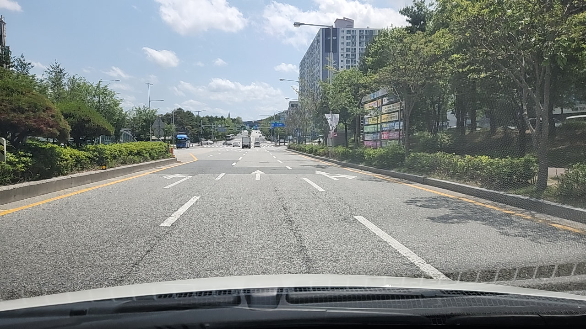 | 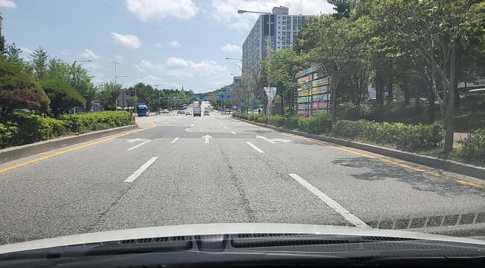 |

| 3. 도로 마스크 (ROI 영역) | 4. 엣지 마스크 |
|---|---|
| 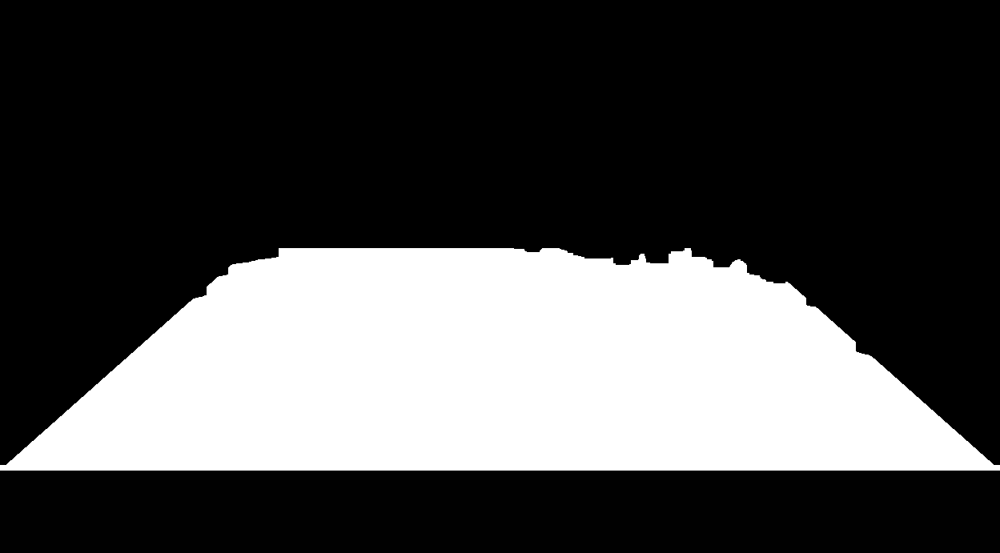 | 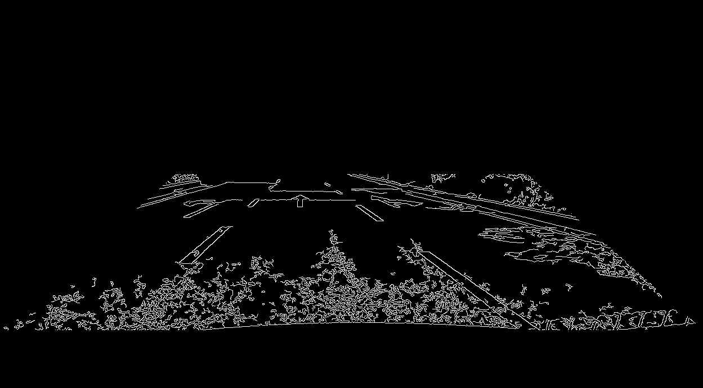 |

| 5. 차선 색상 마스크 | 6. 엣지 + 색상 마스크 |
|---|---|
| 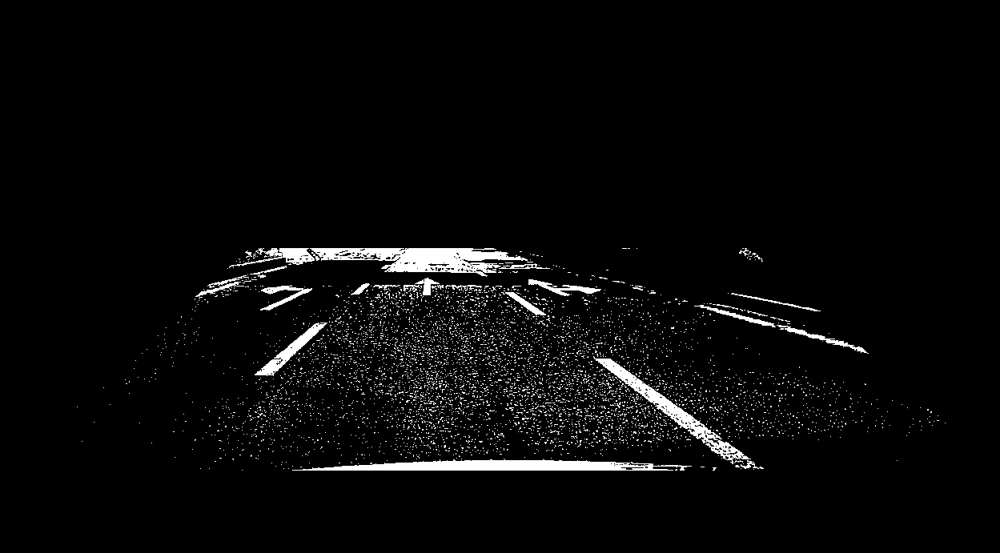 | 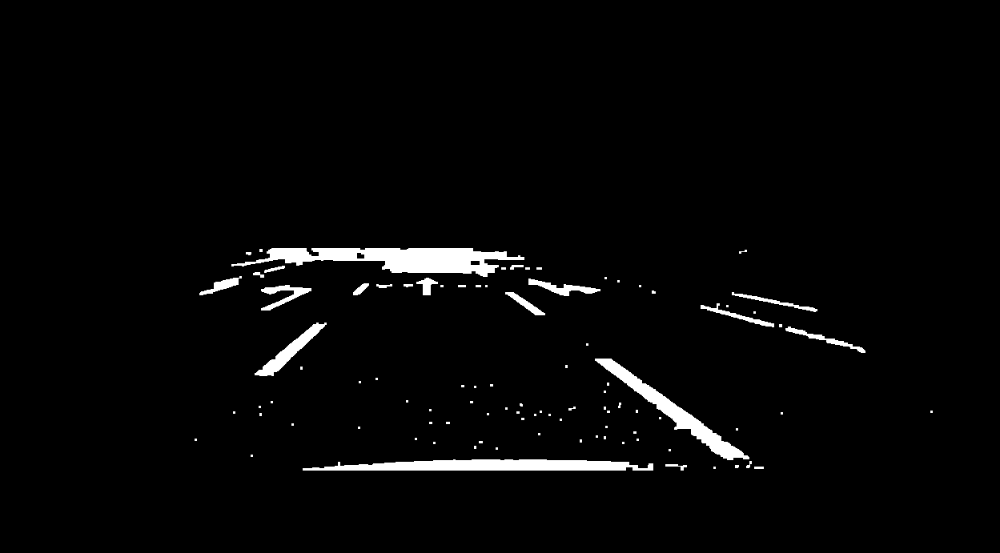 |

| 7. 차선 마스크 | 8. 연장된 차선 마스크 |
|---|---|
| 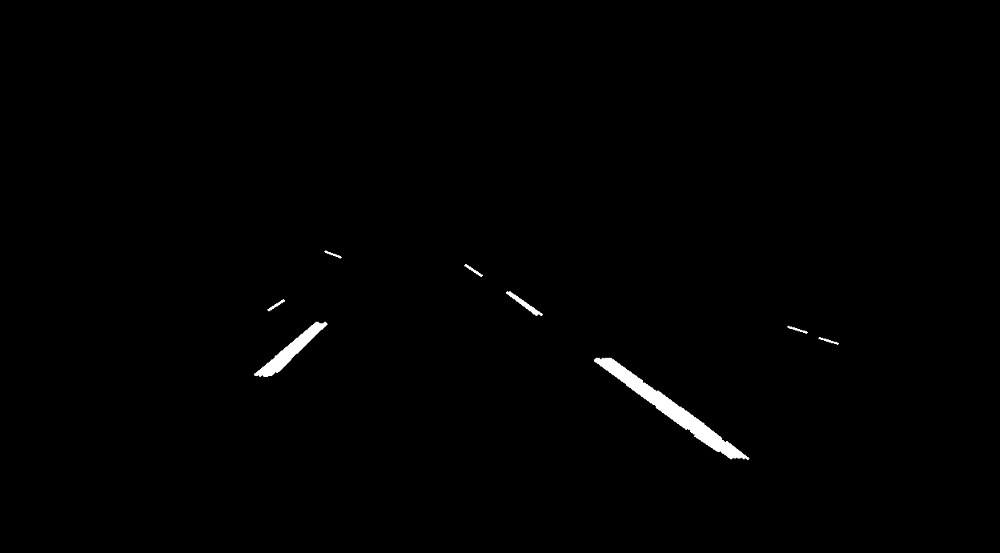 | 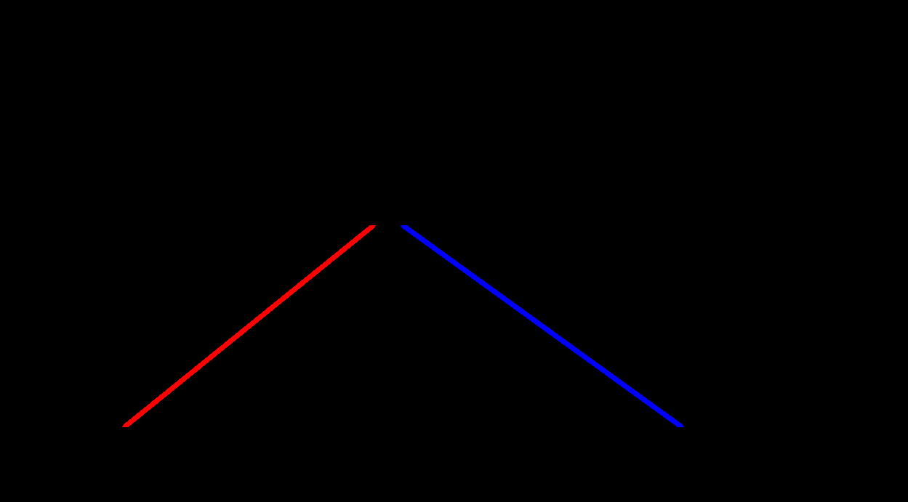 |

| 9. 도로 및 차선 감지 | 10. 손상 감지 (YOLO) |
|---|---|
| 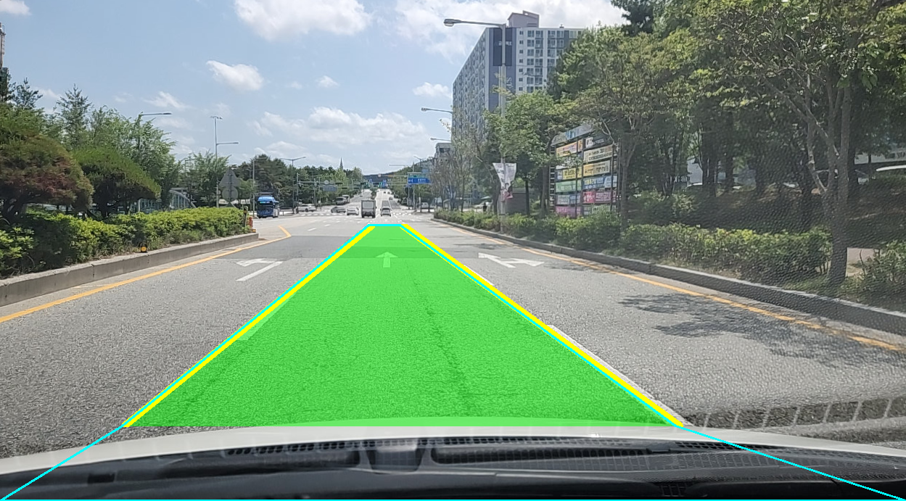 | 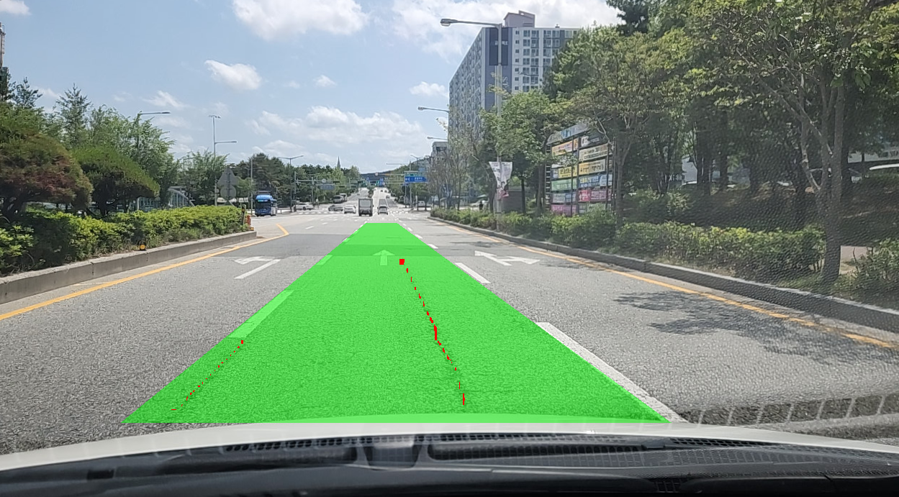 |

| 11. 원근 변환 포인트 지정 | 12. 원근 변환 적용 |
|---|---|
| 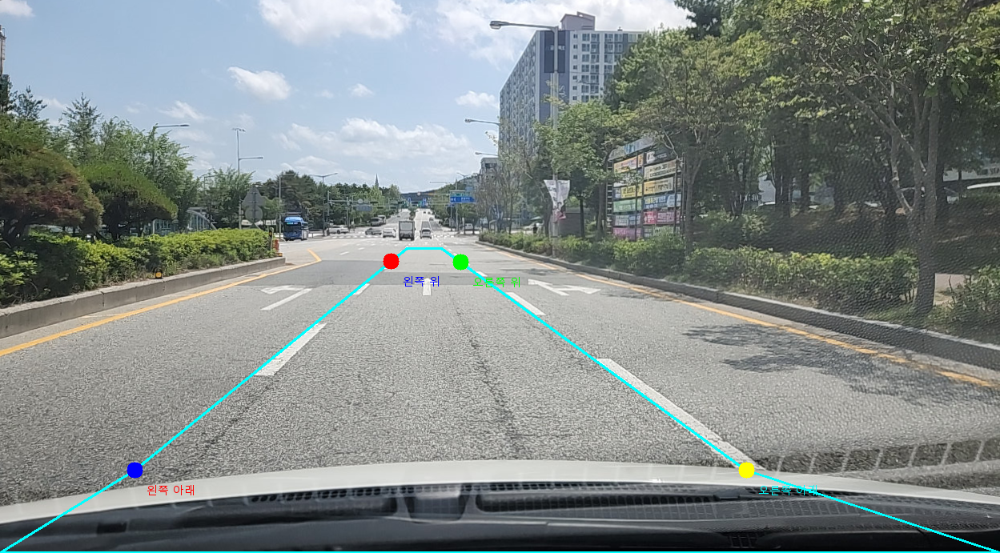 | 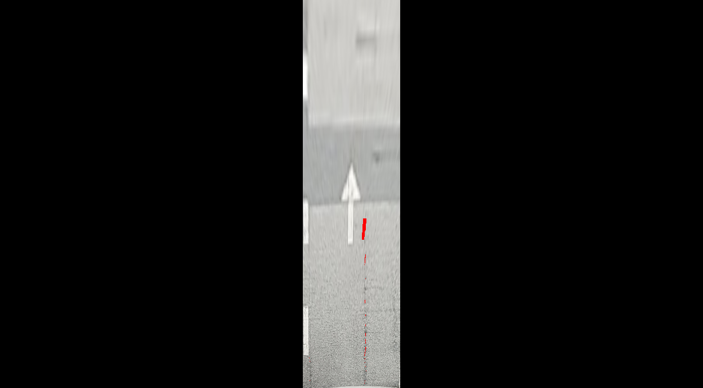 |

## 📈 결과 예시

처리된 결과는 `road_damage_detection/result/` 폴더에 저장:
- 원본 이미지와 감지된 손상 영역이 오버레이된 결과 이미지
- 손상 유형별 통계 정보
- JSON 형태의 상세 분석 결과

## 📄 라이선스

이 프로젝트는 [MIT License](LICENSE) 하에 배포됩니다.
