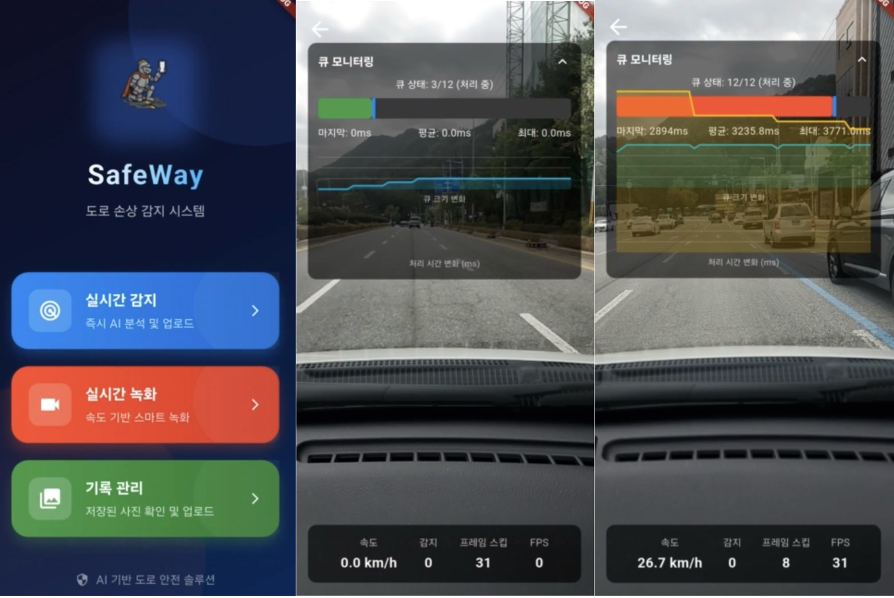
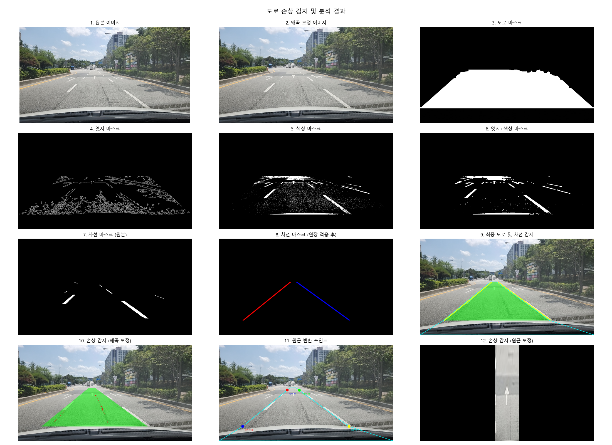
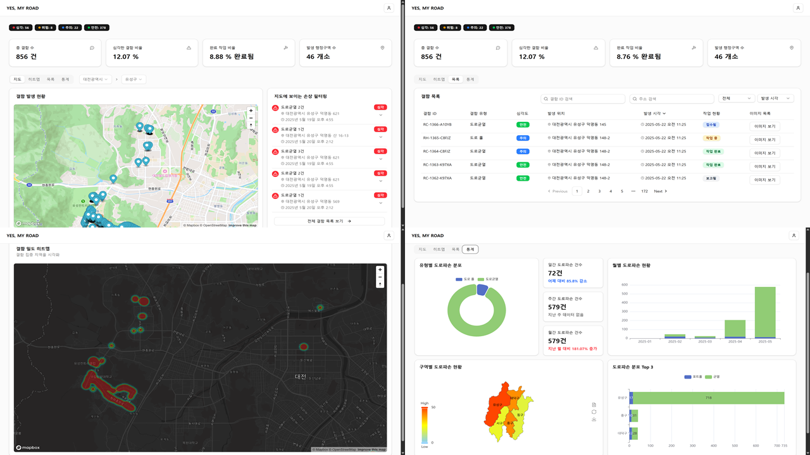
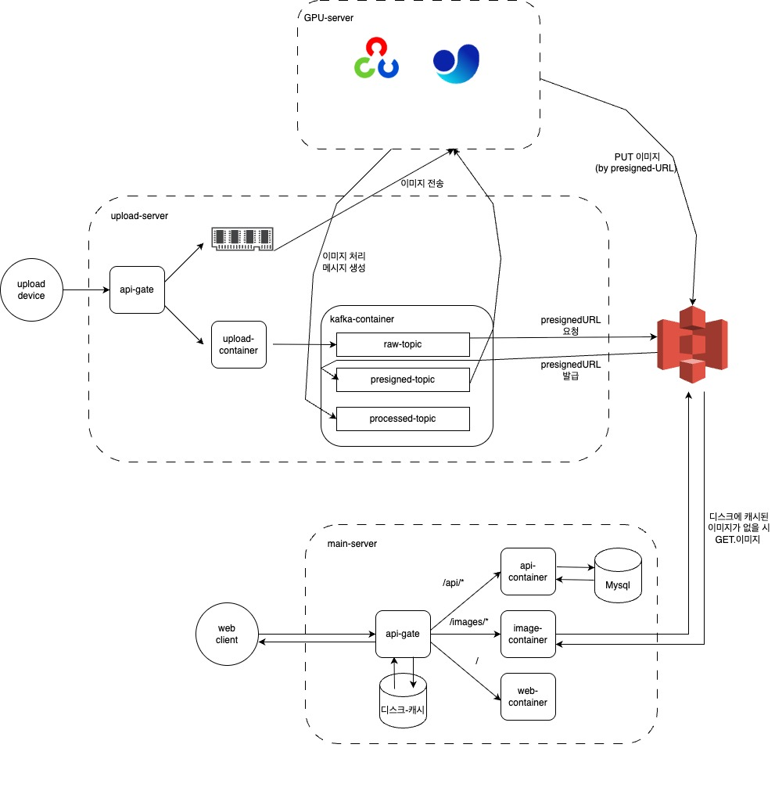

# 예마로 ( Yes My Road )

# 1. 서비스 개요

### [ Detect ]

 

### [ Record ]

### [ Manage ]

  
  

# 2. 시스템 아키텍처

  
  
 
# 3. 파트별 상세 설명 
### [ FrontEnd ] : [FE 바로가기](./FE/README.md)  (조현준, 권동환)

### [ BackEnd ] : [BE 바로가기](./api/README.md)  (김형표)

### [ Infra ] : [BE_UPLOAD 바로가기](./upload_api/README.md),  [BE_IMAGE 바로가기](./image_api/README.md)   (이세중)

### [ APP ] : [APP 바로가기](./APP/README.md) (김동휘)

### [ AI ] : [AI 바로가기](./AI/README.md) (김동휘)

### [ Data ] : [DATA 바로가기](./DT/README.md) (전제후)

  

# 4. 포팅 메뉴얼

### [포팅 메뉴얼] : [포팅 메뉴얼 바로가기](https://foggy-beast-983.notion.site/1fa3a1dda810803ba3b4f4e016959082?pvs=4)

  

#
#
  

# 팀 소개

| 이름 | 역할  | 담당 내용 | 사용 기술 | 
|----------|----------|-----------|-----------|
| 김동휘   | 팀장, 데이터 | 데이터 총괄 | YOLO |
| 전제후   | 데이터 & 시각화 | 이미지 데이터 처리, 통계 대시보드 설계 | OpenCV |
| 조현준   | PM, 프론트엔드 | 지도 화면 설계, 통계 대시보드 구현 | React, NEXT.js, Node.js |
| 권동환   | 프론트엔드 | 로그인 보안 설계, API 연동 | React, NEXT.js, Node.js|
| 김형표   | 백앤드, 데이터베이스 | API 서버, DB 개발 | SpringBoot, Spring Security, mySQL, Redis, JPQL |
| 이세종   | 백엔드, 인프라 | 업로드 서버, 이미지 서버, 인프라 | Spring(MVC, Webflux), kafka, Nginx, Docker, GitLab-CI, S3 |
